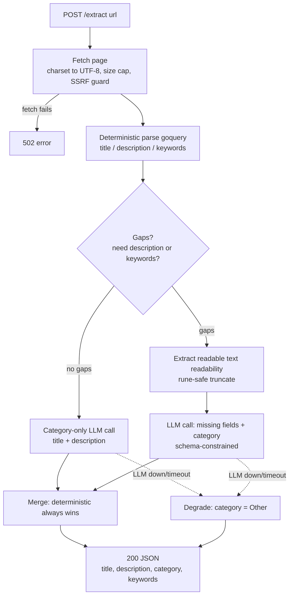
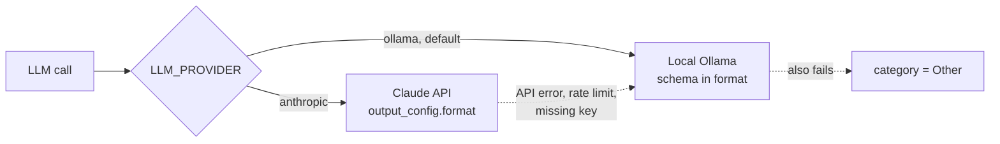

# linkmeta

Self-hosted URL metadata extraction service — fetches a page, reads real metadata from the DOM, and uses a **local** LLM (Ollama) only to fill gaps and classify a category. Built to replace a cloud AI Agent node in an n8n → Linkwarden bookmarking workflow.

[](LICENSE)
[](https://github.com/t0mer/linkmeta/releases)
[](https://hub.docker.com/r/techblog/linkmeta)

---

## What & why

An n8n workflow receives WhatsApp messages (via Green API), extracts a URL, and saves it to [Linkwarden](https://linkwarden.app/) with enriched metadata (title, description, category, keywords). Originally that enrichment was an **OpenAI Agent node** (gpt-4.1-mini) with no fetch tool attached — so it *guessed* metadata from the URL string alone, and it sent every bookmarked link to a cloud provider.

**linkmeta replaces that with a tiered, fully self-hosted approach:**

1. **Deterministic first.** Fetch the actual page and read real metadata from the DOM (`<title>`, `og:*`, `meta[name=description]`, `meta[name=keywords]`). No model needed for anything the page already provides.
2. **Local LLM fallback only for gaps.** For fields the page *doesn't* provide — and always for category classification — it makes at most **one** call to a local [Ollama](https://ollama.com/) model, fed with the page's actual readable text and constrained by a JSON schema so the output is always parseable.

The result: no cloud AI dependency by default, correct original-language metadata (including Hebrew), and graceful degradation — if the model is down, you still get real deterministic metadata back.

> An opt-in `LLM_PROVIDER=anthropic` backend trades that premise for speed: seconds instead of ~100 s on CPU-only hardware, at the cost of sending page content to a cloud API. It is **off by default**, and Ollama stays as its fallback. See [Using the Claude API instead of Ollama](#using-the-claude-api-instead-of-ollama).

The output JSON matches the old n8n Structured Output Parser exactly, so downstream nodes keep working unchanged.

---

## How it works



The LLM call goes to whichever backend `LLM_PROVIDER` selects:



The single LLM call requests **only** the fields the page didn't supply. `category` is always requested and is `enum`-constrained to the configured closed list. Deterministic values are never overwritten by the model.

---

## API documentation

Base URL: `http://<host>:8080`

### `GET | POST /extract`

Extract metadata for a URL.

| | |
|---|---|
| **Methods** | `GET` (query param) or `POST` (JSON body) |
| **GET params** | `url` — the page URL (http/https); `lang` *(optional)* — category output language |
| **POST body** | `{"url": "https://...", "lang": "English"}` (`lang` optional) |
| **Success** | `200` with the metadata JSON below |
| **Validation error** | `400` `{"error": "..."}` — missing url, non-http(s) scheme, or empty host |
| **Fetch error** | `502` `{"error": "..."}` — the page could not be fetched |

The response schema is **frozen** (matches the n8n parser):

```json
{
  "title": "string — original page language",
  "description": "string — original page language",
  "category": "string — English, from the configured closed list",
  "keywords": ["lowercase", "deduped", "original language"]
}
```

`keywords` is always an array (`[]`, never `null`). `category` is always one of the configured categories; it falls back to `"Other"` if the LLM is unavailable.

#### Category language (`lang`)

By default the `category` is returned in **English** (strict — `enum`-constrained to the configured `CATEGORIES` list, so a Hebrew page still yields an English category). You can change the category's output language:

- **Globally** via `CATEGORY_LANGUAGE` (see [Configuration](#configuration)).
- **Per request** via the optional `lang` parameter, which overrides the global default for that call.

`fresh=true` (query param, or `"fresh": true` in the POST body) bypasses the cache and
re-extracts; see [Caching](#caching). The response carries an `X-Cache: HIT|MISS|BYPASS`
header — the JSON body is unchanged either way.

The page is always *classified* against the canonical English list; `lang` only changes the language of the returned label. English keeps the strict enum guarantee; any other language (e.g. `Hebrew`, `Spanish`) returns a **best-effort translated** label. `lang` only affects `category` — `description` and `keywords` stay in the page's original language. On LLM failure the category still falls back to `"Other"`.

```bash
# Hebrew page, but force an English category (this is also the default):
curl 'http://localhost:8080/extract?url=https://www.ynet.co.il/news&lang=English'

# Return the category translated to Hebrew instead:
curl -X POST http://localhost:8080/extract \
  -H 'Content-Type: application/json' \
  -d '{"url": "https://go.dev/blog/", "lang": "Hebrew"}'
```

**GET example**

```bash
curl 'http://localhost:8080/extract?url=https://go.dev/blog/'
```

```json
{
  "title": "The Go Blog",
  "description": "The official Go blog with news and in-depth articles.",
  "category": "Technology",
  "keywords": ["go", "golang", "programming"]
}
```

**POST example**

```bash
curl -X POST http://localhost:8080/extract \
  -H 'Content-Type: application/json' \
  -d '{"url": "https://go.dev/blog/"}'
```

**Hebrew-content example** (original-language title/description/keywords, English category):

```bash
curl -X POST http://localhost:8080/extract \
  -H 'Content-Type: application/json' \
  -d '{"url": "https://www.ynet.co.il/news"}'
```

```json
{
  "title": "חדשות - ynet",
  "description": "עדכוני חדשות מהארץ ומהעולם, כתבות, פרשנויות ותוכן מערכתי.",
  "category": "News",
  "keywords": ["חדשות", "מבזקים", "אקטואליה"]
}
```

**Error examples**

```bash
curl -s -o /dev/null -w '%{http_code}\n' 'http://localhost:8080/extract?url=ftp://x.com'
# 400   -> {"error":"scheme must be http or https"}

curl -s 'http://localhost:8080/extract?url=https://this-host-does-not-exist.invalid'
# 502   -> {"error":"fetch: http get: ..."}
```

### `GET /healthz`

Liveness, deployed version, and a real check that extraction can actually use the LLM.

```bash
curl http://localhost:8080/healthz
```

```json
{"status": "ok", "ollama": "ok", "model": "qwen2.5:3b-instruct", "version": "2026.9.0", "cache": "ok"}
```

`status` is `"ok"` whenever the service is up — it serves `/extract` regardless of Ollama,
degrading rather than failing. `ollama` is the useful field:

| `ollama` | Meaning |
|---|---|
| `"ok"` | Server answered `GET /api/version` **and** the configured model is installed (`POST /api/show`, metadata only — the model is not loaded). |
| `"unreachable"` | The server did not answer. Wrong `OLLAMA_URL`, or Ollama is down. |
| `"model-missing"` | The server is up but the model is not pulled. **Every extraction will degrade to `category: "Other"`** until you `ollama pull` it. |

`cache` is `"ok"`, `"disabled"` (no backend configured), or `"unavailable"` (a configured
Redis is unreachable — requests still succeed, uncached).

The model check matters: Ollama answers `/api/version` happily with zero models pulled, and
the sidecar's `ollama list` healthcheck passes too — so a server-only probe reports `"ok"`
while 100% of requests are silently degrading.

When the most recent LLM call failed, the body also carries the error verbatim, so you can
diagnose without reading container logs (both fields are omitted once a call succeeds):

```json
{
  "status": "ok",
  "ollama": "model-missing",
  "model": "qwen2.5:3b-instruct",
  "version": "2026.9.0",
  "last_llm_error": "ollama status 404: model \"qwen2.5:3b-instruct\" not found",
  "last_llm_error_at": "2026-09-05T09:12:44Z"
}
```

### `GET /metrics`

Prometheus exposition. Exposed series include:

| Metric | Type | Labels |
|---|---|---|
| `linkmeta_http_requests_total` | counter | `path`, `code` |
| `linkmeta_http_request_duration_seconds` | histogram | `path` |
| `linkmeta_llm_calls_total` | counter | `outcome` (`ok`/`error`) |
| `linkmeta_llm_duration_seconds` | histogram | — |
| `linkmeta_fallback_total` | counter | — |
| `linkmeta_cache_total` | counter | `result` (`hit`/`miss`/`bypass`/`error`) |

---

## Installation

linkmeta is a single static binary (`CGO_ENABLED=0`) and ships multi-arch Docker images — **arm64 is fully supported** (the reference deployment is a 2-core arm64 host).

### Docker Compose (recommended — includes the Ollama sidecar)

The bundled `docker-compose.yml` runs linkmeta plus an Ollama sidecar with a named volume for models and healthcheck-gated startup:

```bash
docker compose up -d
# Pull the default model into the Ollama sidecar (first run only):
docker compose exec ollama ollama pull qwen2.5:3b-instruct
```

Then:

```bash
curl 'http://localhost:8080/extract?url=https://go.dev/blog/'
```

### Single container

```bash
docker run -d --name linkmeta -p 8080:8080 \
  -e OLLAMA_URL=http://host.docker.internal:11434 \
  -e OLLAMA_MODEL=qwen2.5:3b-instruct \
  techblog/linkmeta:latest
```

### Pre-built binaries

Every [release](https://github.com/t0mer/linkmeta/releases) attaches static binaries for
Linux (amd64, arm64, armv7, armv6, 386), macOS (Intel, Apple Silicon) and Windows, plus a
`checksums.txt`:

```bash
VERSION=2026.9.0
curl -LO https://github.com/t0mer/linkmeta/releases/download/$VERSION/linkmeta_${VERSION}_linux-arm64
chmod +x linkmeta_${VERSION}_linux-arm64
./linkmeta_${VERSION}_linux-arm64 --version
```

### From source (development)

```bash
git clone https://github.com/t0mer/linkmeta
cd linkmeta
CGO_ENABLED=0 go build -o linkmeta ./cmd/linkmeta
./linkmeta --port 8080

# arm64 cross-compile:
GOOS=linux GOARCH=arm64 CGO_ENABLED=0 go build -o linkmeta-arm64 ./cmd/linkmeta
```

Requires Go 1.25+. Run `go test ./...` for the test suite.

---

## Releases & CI

Versions follow **`YYYY.M.PATCH`** (no leading zero on the month, e.g. `2026.9.0`). The git
tag is the single source of truth — `scripts/next-version.sh` takes today's `YYYY.M`, finds
the latest matching tag and increments the patch, starting each new month at `.0`.

Two workflows, both **manual** (`workflow_dispatch`) — releases are intentional, never
triggered by a push:

| Workflow | Does | Trigger |
|---|---|---|
| `.github/workflows/release.yml` | `go vet` + `go test`, cross-compiles every target into `dist/`, tags, publishes a GitHub Release with the binaries and `checksums.txt` | Manual, optional `version` input (blank = auto-compute) |
| `.github/workflows/docker.yml` | Builds and pushes the multi-arch image to Docker Hub as `techblog/linkmeta:latest` and `:<version>` | Manual, **or** automatically when a Release run completes successfully |

Release build matrix (all `CGO_ENABLED=0`, `-trimpath -ldflags "-s -w -X main.version=..."`):

| OS | Architectures |
|---|---|
| Linux | amd64, arm64, armv7, armv6, 386 |
| macOS | amd64 (Intel), arm64 (Apple Silicon) |
| Windows | amd64, arm64 (`.exe`) |

Docker images are published for `linux/amd64`, `linux/arm64` and `linux/arm/v7`. The Go
binary cross-compiles natively on the build platform (`--platform=$BUILDPLATFORM`), so no
QEMU emulation is involved in the build itself.

Version resolution differs by trigger, so tags stay monotonic without a Release:

- **Release-driven Docker run** — reuses the tag the Release just created.
- **Standalone Docker run** — computes the next patch and pushes that tag *after* a
  successful image push, so repeated manual runs increment instead of republishing.

Repository secrets required for the Docker workflow: `DOCKERHUB_USERNAME` and
`DOCKERHUB_TOKEN`. The release workflow needs no secrets beyond the built-in
`GITHUB_TOKEN`.

To build the full artifact set locally:

```bash
VERSION=$(./scripts/next-version.sh) ./scripts/build.sh   # -> dist/
```

---

## Configuration

Precedence: **flags > environment variables > `config.yaml`** (all optional; sensible defaults for everything). See `config.yaml.example`.

| Env | Flag | Default | Notes |
|---|---|---|---|
| `PORT` | `--port` | `8080` | HTTP listen port |
| `OLLAMA_URL` | `--ollama-url` | `http://localhost:11434` | Ollama base URL |
| `OLLAMA_MODEL` | `--ollama-model` | `qwen2.5:3b-instruct` | Model (better Hebrew than Llama) |
| `OLLAMA_KEEP_ALIVE` | `--ollama-keep-alive` | `24h` | Keep the model resident between calls |
| `CATEGORIES` | `--categories` | *(14-item list below)* | Comma-separated closed list |
| `CATEGORY_LANGUAGE` | `--category-language` | `English` | Language of the returned category label (per-request override: `lang`) |
| `FETCH_TIMEOUT` | `--fetch-timeout` | `20s` | Page fetch timeout |
| `LLM_TIMEOUT` | `--llm-timeout` | `180s` | CPU inference is slow — keep generous |
| `MAX_TEXT_CHARS` | `--max-text-chars` | `3000` | Readable text sent to the model (rune-safe) |
| `LLM_MAX_TOKENS` | `--llm-max-tokens` | `256` | Cap on generated tokens (Ollama `num_predict`). `0` = uncapped |
| `USER_AGENT` | `--user-agent` | realistic Chrome UA | Override for bot-blocking sites |
| `ALLOW_PRIVATE_TARGETS` | `--allow-private-targets` | `false` | Allow fetching private/loopback URLs (SSRF guard off) |
| `CACHE_ENABLED` | `--cache-enabled` | `true` | Cache `/extract` results |
| `CACHE_BACKEND` | `--cache-backend` | `memory` | `memory` (in-process) or `redis` |
| `CACHE_TTL` | `--cache-ttl` | `24h` | TTL for successful results |
| `CACHE_DEGRADED_TTL` | `--cache-degraded-ttl` | `5m` | TTL when the LLM failed (`category: "Other"`) |
| `CACHE_MAX_ENTRIES` | `--cache-max-entries` | `1000` | Entry cap, `memory` backend only |
| `REDIS_URL` | `--redis-url` | `redis://localhost:6379` | Used when `CACHE_BACKEND=redis` |
| `FORCE_LLM` | `--force-llm` | `false` | Always let the model write `description` and `keywords`, overriding the page's own meta tags |
| `LLM_PROVIDER` | `--llm-provider` | `ollama` | Backend: `ollama` (self-hosted) or `anthropic` (Claude API, Ollama kept as fallback) |
| `ANTHROPIC_API_KEY` | *(env only)* | — | Claude API key. Env var only — never put it in `config.yaml` |
| `ANTHROPIC_MODEL` | `--anthropic-model` | `claude-opus-5` | Model used when `LLM_PROVIDER=anthropic` |

Default categories:

```
Technology, News, Social, Food, Health, Shopping, Finance,
Education, Entertainment, Travel, Science, Sports, Home, Other
```

**YAML example** (`config.yaml` in the working directory):

```yaml
port: 8080
ollama_url: http://localhost:11434
ollama_model: qwen2.5:3b-instruct
ollama_keep_alive: 24h
categories: Technology,News,Social,Food,Health,Shopping,Finance,Education,Entertainment,Travel,Science,Sports,Home,Other
category_language: English
fetch_timeout: 20s
llm_timeout: 180s
max_text_chars: 3000
llm_max_tokens: 256
allow_private_targets: false
force_llm: false
```

**Flag equivalents** (same effect as the env vars):

```bash
./linkmeta --port 8080 --ollama-model qwen2.5:3b-instruct --llm-timeout 240s --max-text-chars 2000
```

### Caching

Repeated URLs are served from cache, costing neither a page fetch nor an LLM call — the
difference between ~100 s and ~0 s on CPU-only hardware. On by default.

```bash
curl 'http://localhost:8080/extract?url=https://go.dev/blog/' -i | grep X-Cache
# X-Cache: MISS      first request
# X-Cache: HIT       thereafter
```

**Bypassing the cache.** Add `fresh=true` to force a re-extraction. It skips the *read*
but still writes the result, so it refreshes the entry rather than disabling caching:

```bash
curl 'http://localhost:8080/extract?url=https://go.dev/blog/&fresh=true'      # GET
curl -X POST http://localhost:8080/extract \
  -H 'Content-Type: application/json' \
  -d '{"url":"https://go.dev/blog/","fresh":true}'                            # POST
```

Only an explicit true value (`true`, `1`, `yes`) bypasses; anything unparseable is
treated as `false`, so a typo can't silently disable caching.

**What's in the key.** The URL, the effective `lang`, and a fingerprint of the settings
that shape a result (`FORCE_LLM`, provider, model, category list, default category
language). A Hebrew request therefore never receives an English-labelled cache entry, and
changing any of those settings invalidates prior entries — which matters because Redis
outlives the process.

**Degraded results expire fast.** When the LLM fails, `/extract` still returns 200 with
`category: "Other"`. That is cached under `CACHE_DEGRADED_TTL` (5 m) instead of
`CACHE_TTL` (24 h), so a broken model can't freeze a bad answer in place for a day, while
a retry storm still can't hammer a struggling model.

**Backends.** `memory` (default) is an in-process TTL map bounded by `CACHE_MAX_ENTRIES`;
it needs no extra infrastructure and is lost on restart. `redis` survives restarts and is
shared across instances:

```bash
docker compose --profile redis up -d
# then set on linkmeta:
CACHE_BACKEND=redis
REDIS_URL=redis://redis:6379
```

A cache failure never fails a request — errors are logged, counted in
`linkmeta_cache_total{result="error"}`, and treated as a miss. `/healthz` reports the
backend as `ok`, `disabled`, or `unavailable`, so a dead Redis is visible rather than
silently bypassed.

### Using the Claude API instead of Ollama

> **This trades away the project's core premise.** linkmeta exists to replace a cloud
> AI dependency with self-hosted extraction. With `LLM_PROVIDER=anthropic`, the text of
> every page you bookmark is sent to Anthropic. Use it only if you accept that.

The self-hosted path stays the default. Opt in with:

```bash
LLM_PROVIDER=anthropic
ANTHROPIC_API_KEY=sk-ant-...     # env var only — keep it out of config.yaml
ANTHROPIC_MODEL=claude-opus-5    # optional; this is the default
```

**Ollama remains as the fallback.** Claude is tried first; if the call fails — outage,
rate limit, expired key, no key configured — the request falls back to the local model
rather than degrading straight to `category: "Other"`. Only when *both* fail does the
usual degradation apply, and the error names both causes. Keep the Ollama sidecar
running and its model pulled if you want that safety net.

Why you might: on CPU-only hardware a full-content request takes ~100 s locally; the
same request through the API returns in seconds, and no model needs to stay resident.
Rough cost at linkmeta's prompt size (~1200 input, ~150 output tokens):

| Model | Approx. per request | 20 bookmarks/day |
|---|---|---|
| `claude-opus-5` (default) | ~$0.010 | ~$6/month |
| `claude-sonnet-5` | ~$0.004 | ~$2.40/month |
| `claude-haiku-4-5` | ~$0.002 | ~$1.20/month |

The same JSON schema constrains both backends (`output_config.format` on the API,
`format` on Ollama), so `/extract` returns the identical response shape either way.
`/healthz` reports `ollama: "ok"` when *either* backend is usable.

### Forcing the LLM

By default the page wins: `description` and `keywords` are taken from the page's own
meta tags whenever it provides them, and the model is asked only for what is missing
(plus `category`, which is always model-generated). Set `FORCE_LLM=true` (or
`--force-llm`) to ignore those meta tags and have the model write both fields on every
request — useful when pages carry boilerplate or marketing descriptions you would
rather replace with a real summary of the content.

```bash
FORCE_LLM=true ./linkmeta
```

What changes when it is on:

- `description` and `keywords` always come from the model; the page's values are not
  even shown to it as context, so it summarises the content rather than paraphrasing
  the existing tag.
- Every request takes the **full-content path** — readable text is always extracted and
  sent (up to `MAX_TEXT_CHARS`), so expect the slower latency described in
  [Performance notes](#performance-notes) on every call.
- `title` is unaffected — it always comes from `<title>` / `og:title`.
- Degradation is unchanged: if Ollama fails, you still get the page's own description
  and keywords with `category: "Other"`.

> **Security note (SSRF):** by default linkmeta refuses to fetch URLs that resolve to loopback, private (RFC1918), link-local (incl. the cloud-metadata address `169.254.169.254`), or unique-local addresses — the guard runs on the resolved IP at dial time, on the initial request *and* every redirect hop. Set `ALLOW_PRIVATE_TARGETS=true` only if you deliberately bookmark internal URLs.

---

## Using it from n8n

Replace the three AI nodes with a single HTTP Request node.

**1. Delete these nodes:**
- **AI Agent**
- **OpenAI Chat Model**
- **Structured Output Parser**

**2. Add an HTTP Request node** in their place:

| Setting | Value |
|---|---|
| Method | `POST` |
| URL | `http://<linkmeta-host>:8080/extract` |
| Body Content Type | JSON |
| Body | `{"url": "{{ $('Exctract URL').item.json.url }}"}` (add `"lang": "English"` to force the category language per request) |
| Options → Timeout | **`240000`** ms (must exceed `LLM_TIMEOUT`) |

Example node body (n8n expression):

```json
{
  "url": "={{ $('Exctract URL').item.json.url }}"
}
```

**3. Point downstream nodes at the new node.** The response field names (`title`, `description`, `category`, `keywords`) are identical to the old parser's output, so the **No Collection** / **With Collection** nodes only need their node *reference* updated (e.g. `$('HTTP Request').item.json.title`) — no field renaming required.

> Set the node's **Timeout** above `LLM_TIMEOUT` (240000 ms recommended). On CPU-only hardware a full-content classification can take a while; a too-short n8n timeout will abort the request before linkmeta responds.

---

## Performance notes

Two request paths, very different latency on CPU-only hardware:

- **Fast path (category-only).** When the page already provides description *and* keywords, linkmeta sends only the title + description to the model, and the model emits only a category — a handful of tokens.
- **Full-content path.** When description or keywords are missing, it extracts readable article text (truncated to `MAX_TEXT_CHARS`, default 3000 runes) and the model writes a description plus up to 10 keywords — on the order of 150 generated tokens.

### Measured on the reference target

2-core arm64, 12 GB RAM, no GPU, model resident (`OLLAMA_KEEP_ALIVE=24h`), full-content path:

| Model | Cold | Warm |
|---|---|---|
| `qwen2.5:3b-instruct` | 136 s | 106 s |
| `qwen2.5:1.5b-instruct` | — | ~100 s |

**Halving the model bought roughly 13%, not 2×.** That is the important result: on hardware this
size the run time is dominated by *generation* — measured at roughly 2–3 tokens/sec — so latency
tracks how many tokens the model must emit, far more than how big the model is or how long the
prompt is. Budget ~100 s per full-content request and note that the default `LLM_TIMEOUT=180s`
leaves little headroom; a slower page or a busy box crosses it and degrades to `"Other"`.

### Levers, most effective first

- **Don't make the model write what the page already provides.** Leaving `FORCE_LLM` off is by far the biggest win: a page carrying its own description and keywords needs the model to emit only a category (~5 tokens instead of ~150). `FORCE_LLM=true` removes that path entirely and pins every request to ~100 s.
- **`LLM_MAX_TOKENS` bounds generation** (default 256, Ollama's `num_predict`). It caps the worst case rather than the typical one — a schema response is ~150 tokens — but without it a model that pads the keywords array can run far past the answer. Lower it (e.g. 128) to force shorter output.
- **Reduce `MAX_TEXT_CHARS`** (e.g. 1500) to cut prefill on the full-content path. Real but secondary — prefill is not where the time goes on this hardware.
- **Keep the model resident:** `OLLAMA_KEEP_ALIVE=24h` (default) avoids reload cost; the measurements above show ~30 s of cold-start on the 3b.
- **A smaller model is a modest win, not a fix.** `qwen2.5:1.5b-instruct` is ~13% faster and weaker at Hebrew; `qwen2.5:0.5b-instruct` is faster still but likely too small to classify reliably.
- **If ~100 s is unacceptable, change backend, not model.** `LLM_PROVIDER=anthropic` returns in seconds — at the cost of sending page content off your network. See [Using the Claude API instead of Ollama](#using-the-claude-api-instead-of-ollama).
- **A cached URL costs nothing** — no fetch, no model call. With `CACHE_ENABLED=true` (default) a repeated bookmark returns immediately; see [Caching](#caching).
- Only **one** LLM call is made per request, ever.

---

## Troubleshooting

| Symptom | Cause / fix |
|---|---|
| `"ollama": "unreachable"` in `/healthz`; every category is `Other` | Ollama isn't running or `OLLAMA_URL` is wrong. The service still returns real deterministic metadata — it degrades, it does not fail. Start Ollama / fix the URL, and `ollama pull` the model. |
| `"ollama": "model-missing"` in `/healthz`; every category is `Other` | The server is up but the model was never pulled — `ollama list` passes with zero models, so nothing else catches this. Run `docker compose exec ollama ollama pull qwen2.5:3b-instruct`. |
| `last_llm_error` shows `context canceled` | The *client* hung up mid-inference — the caller's timeout is shorter than the request. This is what n8n produces when its node **Timeout** is below `LLM_TIMEOUT`; raise it (240000 ms recommended). Not a model or network fault. |
| `LLM_PROVIDER=anthropic` but responses are still slow | Claude calls are failing and every request is falling back to the local model. Check `last_llm_error` in `/healthz` — a missing/expired `ANTHROPIC_API_KEY` logs `no API key configured`, and the service warns about it at startup. |
| Every category is `Other` and requests return in well under a second | No inference is happening — the `/api/chat` call is erroring instantly. Read `last_llm_error` in `/healthz` for the verbatim Ollama message (404 = model missing; 400 on `format` = Ollama older than 0.5.0, which predates structured outputs — upgrade it). |
| `502 {"error":"fetch: ..."}` | The target page couldn't be fetched (timeout, DNS, non-2xx). Some sites block bots — set a different `USER_AGENT`. |
| `blocked target address ...` on internal URLs | The SSRF guard refused a private/loopback target. Set `ALLOW_PRIVATE_TARGETS=true` if that's intentional. |
| Garbled / mojibake Hebrew | Legacy sites may serve `windows-1255`. linkmeta normalizes charset to UTF-8 automatically; if a site mislabels its encoding, the raw bytes may still be off at the source. |
| Requests time out in n8n | The model is slow on CPU (~100 s measured for a full-content request). Raise the n8n node **Timeout** above `LLM_TIMEOUT` (240000 ms recommended). To actually reduce the time, cut generated tokens — leave `FORCE_LLM` off — or switch backend; a smaller model buys only ~13% (see [Performance notes](#performance-notes)). |
| First request after startup is slow | Model load. `OLLAMA_KEEP_ALIVE=24h` keeps it resident afterward. |

---

## License

[Apache-2.0](LICENSE).
