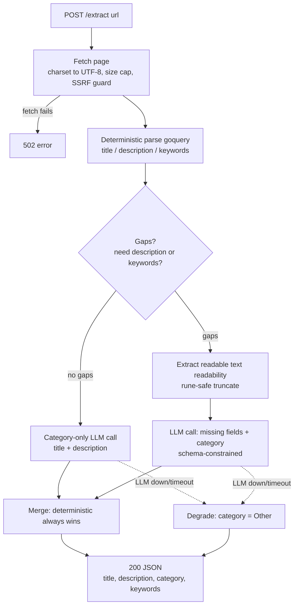

# linkmeta

Self-hosted URL metadata extraction service — fetches a page, reads real metadata from the DOM, and uses a **local** LLM (Ollama) only to fill gaps and classify a category. Built to replace a cloud AI Agent node in an n8n → Linkwarden bookmarking workflow.

[](LICENSE)
[](https://github.com/t0mer/linkmeta/releases)
[](https://hub.docker.com/r/techblog/linkmeta)

---

## What & why

An n8n workflow receives WhatsApp messages (via Green API), extracts a URL, and saves it to [Linkwarden](https://linkwarden.app/) with enriched metadata (title, description, category, keywords). Originally that enrichment was an **OpenAI Agent node** (gpt-4.1-mini) with no fetch tool attached — so it *guessed* metadata from the URL string alone, and it sent every bookmarked link to a cloud provider.

**linkmeta replaces that with a tiered, fully self-hosted approach:**

1. **Deterministic first.** Fetch the actual page and read real metadata from the DOM (`<title>`, `og:*`, `meta[name=description]`, `meta[name=keywords]`). No model needed for anything the page already provides.
2. **Local LLM fallback only for gaps.** For fields the page *doesn't* provide — and always for category classification — it makes at most **one** call to a local [Ollama](https://ollama.com/) model, fed with the page's actual readable text and constrained by a JSON schema so the output is always parseable.

The result: no cloud AI dependency, correct original-language metadata (including Hebrew), and graceful degradation — if the model is down, you still get real deterministic metadata back.

The output JSON matches the old n8n Structured Output Parser exactly, so downstream nodes keep working unchanged.

---

## How it works



The single LLM call requests **only** the fields the page didn't supply. `category` is always requested and is `enum`-constrained to the configured closed list. Deterministic values are never overwritten by the model.

---

## API documentation

Base URL: `http://<host>:8080`

### `GET | POST /extract`

Extract metadata for a URL.

| | |
|---|---|
| **Methods** | `GET` (query param) or `POST` (JSON body) |
| **GET param** | `url` — the page URL (http/https) |
| **POST body** | `{"url": "https://..."}` |
| **Success** | `200` with the metadata JSON below |
| **Validation error** | `400` `{"error": "..."}` — missing url, non-http(s) scheme, or empty host |
| **Fetch error** | `502` `{"error": "..."}` — the page could not be fetched |

The response schema is **frozen** (matches the n8n parser):

```json
{
  "title": "string — original page language",
  "description": "string — original page language",
  "category": "string — English, from the configured closed list",
  "keywords": ["lowercase", "deduped", "original language"]
}
```

`keywords` is always an array (`[]`, never `null`). `category` is always one of the configured categories; it falls back to `"Other"` if the LLM is unavailable.

**GET example**

```bash
curl 'http://localhost:8080/extract?url=https://go.dev/blog/'
```

```json
{
  "title": "The Go Blog",
  "description": "The official Go blog with news and in-depth articles.",
  "category": "Technology",
  "keywords": ["go", "golang", "programming"]
}
```

**POST example**

```bash
curl -X POST http://localhost:8080/extract \
  -H 'Content-Type: application/json' \
  -d '{"url": "https://go.dev/blog/"}'
```

**Hebrew-content example** (original-language title/description/keywords, English category):

```bash
curl -X POST http://localhost:8080/extract \
  -H 'Content-Type: application/json' \
  -d '{"url": "https://www.ynet.co.il/news"}'
```

```json
{
  "title": "חדשות - ynet",
  "description": "עדכוני חדשות מהארץ ומהעולם, כתבות, פרשנויות ותוכן מערכתי.",
  "category": "News",
  "keywords": ["חדשות", "מבזקים", "אקטואליה"]
}
```

**Error examples**

```bash
curl -s -o /dev/null -w '%{http_code}\n' 'http://localhost:8080/extract?url=ftp://x.com'
# 400   -> {"error":"scheme must be http or https"}

curl -s 'http://localhost:8080/extract?url=https://this-host-does-not-exist.invalid'
# 502   -> {"error":"fetch: http get: ..."}
```

### `GET /healthz`

Liveness + Ollama reachability.

```bash
curl http://localhost:8080/healthz
```

```json
{"status": "ok", "ollama": "ok", "model": "qwen2.5:3b-instruct"}
```

`ollama` is `"ok"` or `"unreachable"` (checked with a short-timeout `GET /api/version`). The service is still healthy and serves `/extract` even when Ollama is unreachable.

### `GET /metrics`

Prometheus exposition. Exposed series include:

| Metric | Type | Labels |
|---|---|---|
| `linkmeta_http_requests_total` | counter | `path`, `code` |
| `linkmeta_http_request_duration_seconds` | histogram | `path` |
| `linkmeta_llm_calls_total` | counter | `outcome` (`ok`/`error`) |
| `linkmeta_llm_duration_seconds` | histogram | — |
| `linkmeta_fallback_total` | counter | — |

---

## Installation

linkmeta is a single static binary (`CGO_ENABLED=0`) and ships multi-arch Docker images — **arm64 is fully supported** (the reference deployment is a 2-core arm64 host).

### Docker Compose (recommended — includes the Ollama sidecar)

The bundled `docker-compose.yml` runs linkmeta plus an Ollama sidecar with a named volume for models and healthcheck-gated startup:

```bash
docker compose up -d
# Pull the default model into the Ollama sidecar (first run only):
docker compose exec ollama ollama pull qwen2.5:3b-instruct
```

Then:

```bash
curl 'http://localhost:8080/extract?url=https://go.dev/blog/'
```

### Single container

```bash
docker run -d --name linkmeta -p 8080:8080 \
  -e OLLAMA_URL=http://host.docker.internal:11434 \
  -e OLLAMA_MODEL=qwen2.5:3b-instruct \
  techblog/linkmeta:latest
```

### From source (development)

```bash
git clone https://github.com/t0mer/linkmeta
cd linkmeta
CGO_ENABLED=0 go build -o linkmeta ./cmd/linkmeta
./linkmeta --port 8080

# arm64 cross-compile:
GOOS=linux GOARCH=arm64 CGO_ENABLED=0 go build -o linkmeta-arm64 ./cmd/linkmeta
```

Requires Go 1.25+. Run `go test ./...` for the test suite.

---

## Configuration

Precedence: **flags > environment variables > `config.yaml`** (all optional; sensible defaults for everything). See `config.yaml.example`.

| Env | Flag | Default | Notes |
|---|---|---|---|
| `PORT` | `--port` | `8080` | HTTP listen port |
| `OLLAMA_URL` | `--ollama-url` | `http://localhost:11434` | Ollama base URL |
| `OLLAMA_MODEL` | `--ollama-model` | `qwen2.5:3b-instruct` | Model (better Hebrew than Llama) |
| `OLLAMA_KEEP_ALIVE` | `--ollama-keep-alive` | `24h` | Keep the model resident between calls |
| `CATEGORIES` | `--categories` | *(14-item list below)* | Comma-separated closed list |
| `FETCH_TIMEOUT` | `--fetch-timeout` | `20s` | Page fetch timeout |
| `LLM_TIMEOUT` | `--llm-timeout` | `180s` | CPU inference is slow — keep generous |
| `MAX_TEXT_CHARS` | `--max-text-chars` | `3000` | Readable text sent to the model (rune-safe) |
| `USER_AGENT` | `--user-agent` | realistic Chrome UA | Override for bot-blocking sites |
| `ALLOW_PRIVATE_TARGETS` | `--allow-private-targets` | `false` | Allow fetching private/loopback URLs (SSRF guard off) |

Default categories:

```
Technology, News, Social, Food, Health, Shopping, Finance,
Education, Entertainment, Travel, Science, Sports, Home, Other
```

**YAML example** (`config.yaml` in the working directory):

```yaml
port: 8080
ollama_url: http://localhost:11434
ollama_model: qwen2.5:3b-instruct
ollama_keep_alive: 24h
categories: Technology,News,Social,Food,Health,Shopping,Finance,Education,Entertainment,Travel,Science,Sports,Home,Other
fetch_timeout: 20s
llm_timeout: 180s
max_text_chars: 3000
allow_private_targets: false
```

**Flag equivalents** (same effect as the env vars):

```bash
./linkmeta --port 8080 --ollama-model qwen2.5:3b-instruct --llm-timeout 240s --max-text-chars 2000
```

> **Security note (SSRF):** by default linkmeta refuses to fetch URLs that resolve to loopback, private (RFC1918), link-local (incl. the cloud-metadata address `169.254.169.254`), or unique-local addresses — the guard runs on the resolved IP at dial time, on the initial request *and* every redirect hop. Set `ALLOW_PRIVATE_TARGETS=true` only if you deliberately bookmark internal URLs.

---

## Using it from n8n

Replace the three AI nodes with a single HTTP Request node.

**1. Delete these nodes:**
- **AI Agent**
- **OpenAI Chat Model**
- **Structured Output Parser**

**2. Add an HTTP Request node** in their place:

| Setting | Value |
|---|---|
| Method | `POST` |
| URL | `http://<linkmeta-host>:8080/extract` |
| Body Content Type | JSON |
| Body | `{"url": "{{ $('Exctract URL').item.json.url }}"}` |
| Options → Timeout | **`240000`** ms (must exceed `LLM_TIMEOUT`) |

Example node body (n8n expression):

```json
{
  "url": "={{ $('Exctract URL').item.json.url }}"
}
```

**3. Point downstream nodes at the new node.** The response field names (`title`, `description`, `category`, `keywords`) are identical to the old parser's output, so the **No Collection** / **With Collection** nodes only need their node *reference* updated (e.g. `$('HTTP Request').item.json.title`) — no field renaming required.

> Set the node's **Timeout** above `LLM_TIMEOUT` (240000 ms recommended). On CPU-only hardware a full-content classification can take a while; a too-short n8n timeout will abort the request before linkmeta responds.

---

## Performance notes

Two request paths, very different latency on CPU-only hardware:

- **Fast path (category-only).** When the page already provides description *and* keywords, linkmeta sends only the title + description to the model — a short prompt, so classification is quick.
- **Full-content path.** When description or keywords are missing, it extracts readable article text (truncated to `MAX_TEXT_CHARS`, default 3000 runes) and includes it in the prompt. More tokens → slower on CPU.

Tuning tips for the 2-core arm64 / 12 GB target:

- **Keep the model resident:** `OLLAMA_KEEP_ALIVE=24h` (default) avoids reload cost between requests.
- **`qwen2.5:3b-instruct`** is the default — good Hebrew, ~2–3 GB RAM resident. To go faster, switch to a smaller model:
  ```bash
  docker compose exec ollama ollama pull qwen2.5:1.5b-instruct
  # then set OLLAMA_MODEL=qwen2.5:1.5b-instruct and restart linkmeta
  ```
- **Reduce `MAX_TEXT_CHARS`** (e.g. 1500) to cut prompt size on the full-content path.
- Only **one** LLM call is made per request, ever.

---

## Troubleshooting

| Symptom | Cause / fix |
|---|---|
| `"ollama": "unreachable"` in `/healthz`; every category is `Other` | Ollama isn't running or `OLLAMA_URL` is wrong. The service still returns real deterministic metadata — it degrades, it does not fail. Start Ollama / fix the URL, and `ollama pull` the model. |
| `502 {"error":"fetch: ..."}` | The target page couldn't be fetched (timeout, DNS, non-2xx). Some sites block bots — set a different `USER_AGENT`. |
| `blocked target address ...` on internal URLs | The SSRF guard refused a private/loopback target. Set `ALLOW_PRIVATE_TARGETS=true` if that's intentional. |
| Garbled / mojibake Hebrew | Legacy sites may serve `windows-1255`. linkmeta normalizes charset to UTF-8 automatically; if a site mislabels its encoding, the raw bytes may still be off at the source. |
| Requests time out in n8n | The model is slow on CPU. Raise the n8n node **Timeout** above `LLM_TIMEOUT`, and/or lower `MAX_TEXT_CHARS` or switch to a smaller model. |
| First request after startup is slow | Model load. `OLLAMA_KEEP_ALIVE=24h` keeps it resident afterward. |

---

## License

[Apache-2.0](LICENSE).
