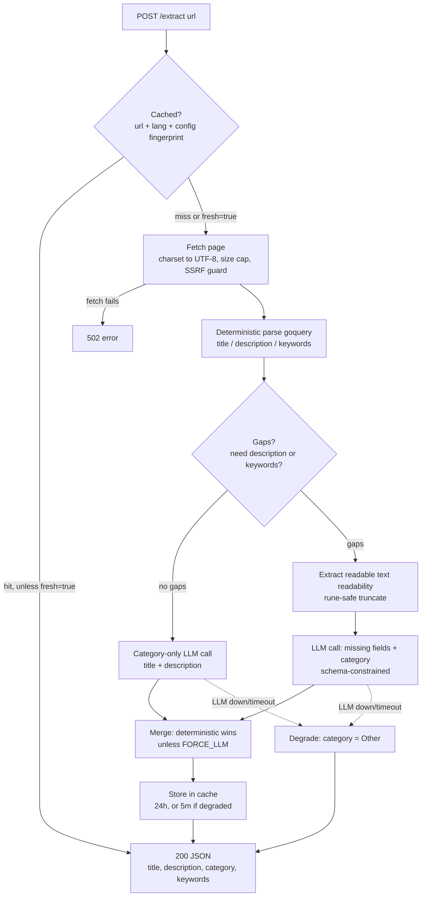
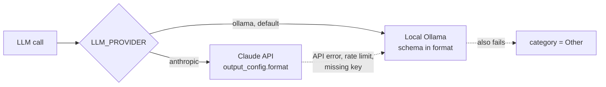

# linkmeta

Self-hosted URL metadata extraction service — fetches a page, reads real metadata from the DOM, and uses a **local** LLM (Ollama) only to fill gaps and classify a category. The Claude API can optionally be used instead, with Ollama as its fallback. Built to replace a cloud AI Agent node in an n8n → Linkwarden bookmarking workflow.

[](LICENSE)
[](https://github.com/t0mer/linkmeta/tags)
[](https://hub.docker.com/r/techblog/linkmeta)

## Contents

- [What & why](#what--why)
- [Features](#features)
- [How it works](#how-it-works)
- [API documentation](#api-documentation)
- [Installation](#installation)
- [Releases & CI](#releases--ci)
- [Configuration](#configuration)
  - [Caching](#caching)
  - [Using the Claude API instead of Ollama](#using-the-claude-api-instead-of-ollama)
  - [Forcing the LLM](#forcing-the-llm)
  - [Logging](#logging)
- [Using it from n8n](#using-it-from-n8n)
- [Performance notes](#performance-notes)
- [Security](#security)
- [Troubleshooting](#troubleshooting)
- [Development](#development)
- [Contributing](#contributing)
- [License](#license)

---

## What & why

An n8n workflow receives WhatsApp messages (via Green API), extracts a URL, and saves it to [Linkwarden](https://linkwarden.app/) with enriched metadata (title, description, category, keywords). Originally that enrichment was an **OpenAI Agent node** (gpt-4.1-mini) with no fetch tool attached — so it *guessed* metadata from the URL string alone, and it sent every bookmarked link to a cloud provider.

**linkmeta replaces that with a tiered, fully self-hosted approach:**

1. **Deterministic first.** Fetch the actual page and read real metadata from the DOM (`<title>`, `og:*`, `meta[name=description]`, `meta[name=keywords]`). No model needed for anything the page already provides.
2. **Local LLM fallback only for gaps.** For fields the page *doesn't* provide — and always for category classification — it makes at most **one** call to a local [Ollama](https://ollama.com/) model, fed with the page's actual readable text and constrained by a JSON schema so the output is always parseable.

The result: no cloud AI dependency by default, correct original-language metadata (including Hebrew), and graceful degradation — if the model is down, you still get real deterministic metadata back.

> An opt-in `LLM_PROVIDER=anthropic` backend trades that premise for speed: seconds instead of ~100 s on CPU-only hardware, at the cost of sending page content to a cloud API. It is **off by default**, and Ollama stays as its fallback. See [Using the Claude API instead of Ollama](#using-the-claude-api-instead-of-ollama).

The output JSON matches the old n8n Structured Output Parser exactly, so downstream nodes keep working unchanged.

---

## Features

- **Deterministic metadata first** — `title`, `description` and `keywords` come from the page's own tags whenever it has them.
- **One schema-constrained LLM call** per request to fill gaps and pick a `category` from a closed, configurable list.
- **Two LLM backends** — local Ollama (default) or the Claude API, with Ollama as the automatic fallback. Claude traffic can optionally go through Cloudflare AI Gateway.
- **Graceful degradation** — if the model fails, you still get the page's real metadata, with `category: "Other"`.
- **Original-language output** (including Hebrew), with an optional translated category label (`lang`).
- **Result cache** — in-process memory (default) or Redis, with a short TTL for degraded results and a per-request bypass.
- **SSRF fetch guard** — private, loopback and link-local targets are refused by default.
- **Charset normalization** — legacy encodings (e.g. `windows-1255`) are converted to UTF-8.
- **Observability** — Prometheus metrics on `/metrics`, and a `/healthz` that checks that the model is actually installed.
- **Small footprint** — one static binary (`CGO_ENABLED=0`), a `scratch` Docker image for amd64, arm64 and armv7.

---

## How it works


```mermaid
flowchart TD
    A[POST /extract url] --> K{Cached?<br/>url + lang + config fingerprint}
    K -->|hit, unless fresh=true| I
    K -->|miss or fresh=true| B
    B[Fetch page<br/>charset to UTF-8, size cap, SSRF guard]
    B -->|fetch fails| E[502 error]
    B --> C[Deterministic parse goquery<br/>title / description / keywords]
    C --> D{Gaps?<br/>need description or keywords?}
    D -->|no gaps| G[Category-only LLM call<br/>title + description]
    D -->|gaps| F[Extract readable text readability<br/>rune-safe truncate]
    F --> G2[LLM call: missing fields + category<br/>schema-constrained]
    G --> H[Merge: deterministic wins<br/>unless FORCE_LLM]
    G2 --> H
    H --> S[Store in cache<br/>24h, or 5m if degraded]
    S --> I[200 JSON<br/>title, description, category, keywords]
    G -.->|LLM down/timeout| J[Degrade: category = Other]
    G2 -.->|LLM down/timeout| J
    J --> I
```

The LLM call goes to whichever backend `LLM_PROVIDER` selects:


```mermaid
flowchart LR
    L[LLM call] --> P{LLM_PROVIDER}
    P -->|ollama, default| O[Local Ollama<br/>schema in format]
    P -->|anthropic| A[Claude API<br/>output_config.format]
    A -.->|API error, rate limit,<br/>missing key| O
    O -.->|also fails| J[category = Other]
```

A repeated URL short-circuits at the first step: no fetch, no model call. See
[Caching](#caching).

The single LLM call requests **only** the fields the page didn't supply. `category` is always requested and is `enum`-constrained to the configured closed list. Deterministic values are never overwritten by the model (unless you turn on [`FORCE_LLM`](#forcing-the-llm)).

Where each field comes from:

| Field | Source, in order |
|---|---|
| `title` | `<title>` → `og:title` → the URL's host name. Never generated by the model. |
| `description` | `meta[name=description]` → `og:description` → the model (one sentence, page language). |
| `keywords` | `meta[name=keywords]` → the model (3–10 keywords). Always trimmed, lowercased, de-duplicated and capped at 10. |
| `category` | Always the model. `"Other"` when the model call fails. |

Fetch details: the page is fetched with a `GET` (the configured `User-Agent`, `Accept-Language: he,en;q=0.8`), redirects are followed (at most 10), the body is capped at 3 MiB, and it is converted to UTF-8 from the `Content-Type`, `<meta>` charset or BOM. A non-2xx response is a fetch error. Readable text for the model comes from a readability extraction, falling back to the page body without scripts, styles, navigation, header and footer.

---

## API documentation

Base URL: `http://<host>:8080`

There is **no authentication** on any endpoint — see [Security](#security).

| Method | Path | Purpose |
|---|---|---|
| `GET`, `POST` | `/extract` | Extract metadata for a URL |
| `GET` | `/healthz` | Liveness, version, LLM and cache status |
| any | `/metrics` | Prometheus metrics |

Any other path returns `404`; an unsupported method on `/extract` or `/healthz` returns `405`.

### `GET | POST /extract`

Extract metadata for a URL.

| | |
|---|---|
| **Methods** | `GET` (query param) or `POST` (JSON body) |
| **GET params** | `url` — the page URL (http/https); `lang` *(optional)* — category output language; `fresh` *(optional)* — bypass the cache read |
| **POST body** | `{"url": "https://...", "lang": "English", "fresh": false}` (`lang` and `fresh` optional; `fresh` must be a JSON boolean) |
| **Success** | `200` with the metadata JSON below, plus an `X-Cache` header |
| **Validation error** | `400` `{"error": "..."}` — `invalid JSON body` (POST), `missing url`, `scheme must be http or https`, `host is empty`, or `parse url: ...` |
| **Fetch error** | `502` `{"error": "fetch: ..."}` — the page could not be fetched (network error, timeout, blocked target, non-2xx status) |

An LLM failure is **not** an error: the request still returns `200`, with `category: "Other"`.

The response schema is **frozen** (matches the n8n parser):

```json
{
  "title": "string — original page language",
  "description": "string — original page language",
  "category": "string — English, from the configured closed list",
  "keywords": ["lowercase", "deduped", "original language"]
}
```

`keywords` is always an array (`[]`, never `null`). With the default English category language, `category` is always one of the configured categories; with any other `lang`/`CATEGORY_LANGUAGE` it is a free, translated string. If the LLM is unavailable it falls back to `"Other"`, a hard-coded value, even when `CATEGORIES` doesn't include it.

#### Category language (`lang`)

By default the `category` is returned in **English** (strict — `enum`-constrained to the configured `CATEGORIES` list, so a Hebrew page still yields an English category). You can change the category's output language:

- **Globally** via `CATEGORY_LANGUAGE` (see [Configuration](#configuration)).
- **Per request** via the optional `lang` parameter, which overrides the global default for that call.

`fresh=true` (query param, or `"fresh": true` in the POST body) bypasses the cache and
re-extracts; see [Caching](#caching). The response carries an `X-Cache: HIT|MISS|BYPASS`
header (`DISABLED` when caching is off) — the JSON body is unchanged either way.

The page is always *classified* against the canonical English list; `lang` only changes the language of the returned label. English (also `en`, or blank; case-insensitive) keeps the strict enum guarantee; any other language (e.g. `Hebrew`, `Spanish`) returns a **best-effort translated** label. `lang` only affects `category` — `description` and `keywords` stay in the page's original language. On LLM failure the category still falls back to `"Other"`.

```bash
# Hebrew page, but force an English category (this is also the default):
curl 'http://localhost:8080/extract?url=https://www.ynet.co.il/news&lang=English'

# Return the category translated to Hebrew instead:
curl -X POST http://localhost:8080/extract \
  -H 'Content-Type: application/json' \
  -d '{"url": "https://go.dev/blog/", "lang": "Hebrew"}'
```

**GET example**

```bash
curl 'http://localhost:8080/extract?url=https://go.dev/blog/'
```

```json
{
  "title": "The Go Blog",
  "description": "The official Go blog with news and in-depth articles.",
  "category": "Technology",
  "keywords": ["go", "golang", "programming"]
}
```

**POST example**

```bash
curl -X POST http://localhost:8080/extract \
  -H 'Content-Type: application/json' \
  -d '{"url": "https://go.dev/blog/"}'
```

**Hebrew-content example** (original-language title/description/keywords, English category):

```bash
curl -X POST http://localhost:8080/extract \
  -H 'Content-Type: application/json' \
  -d '{"url": "https://www.ynet.co.il/news"}'
```

```json
{
  "title": "חדשות - ynet",
  "description": "עדכוני חדשות מהארץ ומהעולם, כתבות, פרשנויות ותוכן מערכתי.",
  "category": "News",
  "keywords": ["חדשות", "מבזקים", "אקטואליה"]
}
```

**Error examples**

```bash
curl -s -o /dev/null -w '%{http_code}\n' 'http://localhost:8080/extract?url=ftp://x.com'
# 400   -> {"error":"scheme must be http or https"}

curl -s 'http://localhost:8080/extract?url=https://this-host-does-not-exist.invalid'
# 502   -> {"error":"fetch: http get: ..."}

curl -s 'http://localhost:8080/extract?url=https://go.dev/no-such-page'
# 502   -> {"error":"fetch: http status 404"}
```

### `GET /healthz`

Liveness, deployed version, and a real check that extraction can actually use the LLM.

```bash
curl http://localhost:8080/healthz
```

```json
{"status": "ok", "ollama": "ok", "model": "qwen2.5:3b-instruct", "version": "2026.9.0", "cache": "ok"}
```

The endpoint always answers `200`. The LLM probes share a 2-second timeout.

`status` is `"ok"` whenever the service is up — it serves `/extract` regardless of Ollama,
degrading rather than failing. `ollama` is the useful field:

| `ollama` | Meaning |
|---|---|
| `"ok"` | Server answered `GET /api/version` **and** the configured model is installed (`POST /api/show`, metadata only — the model is not loaded). |
| `"unreachable"` | The server did not answer. Wrong `OLLAMA_URL`, or Ollama is down. |
| `"model-missing"` | The server is up but the model is not pulled. **Every extraction will degrade to `category: "Other"`** until you `ollama pull` it. |

With `LLM_PROVIDER=anthropic`, `ollama` reflects *either* backend: it is `"ok"` when Claude or
Ollama is usable. The `model` field always shows `OLLAMA_MODEL`, even when Claude is the
primary.

`cache` is `"ok"`, `"disabled"` (caching turned off, or the backend could not be built at
startup), or `"unavailable"` (a configured Redis is unreachable — requests still succeed,
uncached).

The model check matters: Ollama answers `/api/version` happily with zero models pulled, and
the sidecar's `ollama list` healthcheck passes too — so a server-only probe reports `"ok"`
while 100% of requests are silently degrading.

When the most recent LLM call failed, the body also carries the error verbatim, so you can
diagnose without reading container logs (both fields are omitted once a call succeeds):

```json
{
  "status": "ok",
  "ollama": "model-missing",
  "model": "qwen2.5:3b-instruct",
  "version": "2026.9.0",
  "cache": "ok",
  "last_llm_error": "ollama status 404: model \"qwen2.5:3b-instruct\" not found",
  "last_llm_error_at": "2026-09-05T09:12:44Z"
}
```

### `GET /metrics`

Prometheus exposition. Besides the standard Go runtime (`go_*`) and process (`process_*`)
collectors, linkmeta exposes:

| Metric | Type | Labels | Meaning |
|---|---|---|---|
| `linkmeta_http_requests_total` | counter | `path`, `code` | Requests by route pattern and status code |
| `linkmeta_http_request_duration_seconds` | histogram | `path` | Request latency (default Prometheus buckets) |
| `linkmeta_llm_calls_total` | counter | `outcome` (`ok`/`error`/`fallback`) | `ok`/`error` is the final outcome per request; `fallback` counts Claude failures that were handed to Ollama |
| `linkmeta_llm_duration_seconds` | histogram | — | LLM time per request, including any fallback (buckets 1–300 s) |
| `linkmeta_fallback_total` | counter | — | Requests degraded to `category: "Other"` |
| `linkmeta_cache_total` | counter | `result` (`hit`/`miss`/`bypass`/`error`) | Cache lookups |

---

## Installation

linkmeta is a single static binary (`CGO_ENABLED=0`) and ships multi-arch Docker images — **arm64 is fully supported** (the reference deployment is a 2-core arm64 host).

### Docker Compose (recommended — includes the Ollama sidecar)

The bundled `docker-compose.yml` runs linkmeta plus an Ollama sidecar with a named volume for models and healthcheck-gated startup:

```bash
docker compose up -d
# Pull the default model into the Ollama sidecar (first run only):
docker compose exec ollama ollama pull qwen2.5:3b-instruct
```

Then:

```bash
curl 'http://localhost:8080/extract?url=https://go.dev/blog/'
```

The Ollama sidecar's port is not published to the host; only linkmeta's `8080` is. The
compose file also sets `LOG_LEVEL`, but linkmeta does not read it (see [Logging](#logging)).

### Single container

```bash
docker run -d --name linkmeta -p 8080:8080 \
  --add-host=host.docker.internal:host-gateway \
  -e OLLAMA_URL=http://host.docker.internal:11434 \
  -e OLLAMA_MODEL=qwen2.5:3b-instruct \
  techblog/linkmeta:latest
```

`--add-host` is needed on Linux for `host.docker.internal` to resolve; Docker Desktop
provides it already. Ollama on the host must listen on an address the container can reach.

Published tags on Docker Hub: `latest`, and one tag per version (`2026.9.0`, `2026.9.1`, …),
each for `linux/amd64`, `linux/arm64` and `linux/arm/v7`. The image is built `FROM scratch`:
it holds only the binary and CA certificates, with no shell. To use a `config.yaml` in the
container, mount it at `/config.yaml` (the working directory is `/`).

> Features merged after `2026.9.1` — currently the Cloudflare AI Gateway support — are not
> in a published image yet. Build from source until the next image is published.

### Pre-built binaries

The [release workflow](#releases--ci) attaches static binaries for Linux (amd64, arm64,
armv7, armv6, 386), macOS (Intel, Apple Silicon) and Windows (amd64, arm64), plus a
`checksums.txt`. **No GitHub Release has been published yet**, so for now use the Docker
image or build from source. Once a release exists:

```bash
VERSION=2026.9.0
curl -LO https://github.com/t0mer/linkmeta/releases/download/$VERSION/linkmeta_${VERSION}_linux-arm64
chmod +x linkmeta_${VERSION}_linux-arm64
./linkmeta_${VERSION}_linux-arm64 --version
```

Asset names are `linkmeta_<version>_<os>-<arch>`, e.g. `linux-armv7`, `darwin-arm64`,
`windows-amd64.exe`.

### From source (development)

```bash
git clone https://github.com/t0mer/linkmeta
cd linkmeta
CGO_ENABLED=0 go build -o linkmeta ./cmd/linkmeta
./linkmeta --port 8080

# arm64 cross-compile:
GOOS=linux GOARCH=arm64 CGO_ENABLED=0 go build -o linkmeta-arm64 ./cmd/linkmeta
```

Requires Go 1.25.11+ (the `go` directive in `go.mod`). See [Development](#development).

### Command line

```bash
./linkmeta --help       # every flag, with its default
./linkmeta --version    # print the build version (also -v)
```

The server listens on all interfaces on `PORT` and shuts down gracefully (10 s) on
`SIGINT`/`SIGTERM`.

---

## Releases & CI

Versions follow **`YYYY.M.PATCH`** (no leading zero on the month, e.g. `2026.9.0`). The git
tag is the single source of truth — `scripts/next-version.sh` takes today's `YYYY.M`, finds
the latest matching tag and increments the patch, starting each new month at `.0`.

Three workflows. None runs on a push — releases are intentional:

| Workflow | Does | Trigger |
|---|---|---|
| `.github/workflows/release.yml` | `go vet` + `go test`, cross-compiles every target into `dist/`, tags, publishes a GitHub Release with the binaries and `checksums.txt` | Manual, optional `version` input (blank = auto-compute) |
| `.github/workflows/docker.yml` | Builds and pushes the multi-arch image to Docker Hub as `<DOCKERHUB_USERNAME>/linkmeta:latest` and `:<version>` (published as `techblog/linkmeta`) | Manual, **or** automatically when a Release run completes successfully |
| `.github/workflows/publish-ghcr.yml` | Builds and pushes the multi-arch image to `ghcr.io/t0mer/linkmeta:<tag>` and `:latest` | Manual only, optional `tag` input (default `latest`) |

No GHCR image is publicly available at the moment; use Docker Hub.

The repo also carries a `.goreleaser.yaml` (Linux-only `tar.gz` archives, per-arch Docker
images and manifests). No workflow uses it; the release workflow builds with
`scripts/build.sh`.

Release build matrix (all `CGO_ENABLED=0`, `-trimpath -ldflags "-s -w -X main.version=..."`):

| OS | Architectures |
|---|---|
| Linux | amd64, arm64, armv7, armv6, 386 |
| macOS | amd64 (Intel), arm64 (Apple Silicon) |
| Windows | amd64, arm64 (`.exe`) |

Docker images are published for `linux/amd64`, `linux/arm64` and `linux/arm/v7`. The Go
binary cross-compiles natively on the build platform (`--platform=$BUILDPLATFORM`), so no
QEMU emulation is involved in the build itself.

Version resolution differs by trigger, so tags stay monotonic without a Release:

- **Release-driven Docker run** — reuses the tag the Release just created.
- **Standalone Docker run** — computes the next patch and pushes that tag *after* a
  successful image push, so repeated manual runs increment instead of republishing.

Repository secrets required for the Docker workflow: `DOCKERHUB_USERNAME` (also used as
the image namespace) and `DOCKERHUB_TOKEN`. The release and GHCR workflows need no secrets
beyond the built-in `GITHUB_TOKEN`.

To build the full artifact set locally:

```bash
VERSION=$(./scripts/next-version.sh) ./scripts/build.sh   # -> dist/
```

---

## Configuration

Precedence: **flags > environment variables > `config.yaml` > built-in defaults** (all optional; sensible defaults for everything). See `config.yaml.example`.

`config.yaml` is read from the **current working directory** only (`/config.yaml` in the
Docker image). A missing file is fine; a malformed one is a startup error. YAML keys are the
env var names in lower case. Durations use Go syntax (`20s`, `5m`, `24h`).

| Env | Flag | YAML key | Default | Notes |
|---|---|---|---|---|
| `PORT` | `--port` | `port` | `8080` | HTTP listen port |
| `OLLAMA_URL` | `--ollama-url` | `ollama_url` | `http://localhost:11434` | Ollama base URL |
| `OLLAMA_MODEL` | `--ollama-model` | `ollama_model` | `qwen2.5:3b-instruct` | Model (better Hebrew than Llama) |
| `OLLAMA_KEEP_ALIVE` | `--ollama-keep-alive` | `ollama_keep_alive` | `24h` | Keep the model resident between calls |
| `CATEGORIES` | `--categories` | `categories` | *(14-item list below)* | Comma-separated closed list (a single string, also in YAML) |
| `CATEGORY_LANGUAGE` | `--category-language` | `category_language` | `English` | Language of the returned category label (per-request override: `lang`) |
| `FETCH_TIMEOUT` | `--fetch-timeout` | `fetch_timeout` | `20s` | Page fetch timeout, redirects included |
| `LLM_TIMEOUT` | `--llm-timeout` | `llm_timeout` | `180s` | Per Ollama call, and per HTTP attempt for Claude (the SDK retries up to 2 times, so one Claude call can take up to 3× this plus backoff). CPU inference is slow — keep generous |
| `MAX_TEXT_CHARS` | `--max-text-chars` | `max_text_chars` | `3000` | Readable text sent to the model (rune-safe) |
| `LLM_MAX_TOKENS` | `--llm-max-tokens` | `llm_max_tokens` | `256` | Cap on generated tokens (Ollama `num_predict`). `0` = uncapped. Ollama only |
| `USER_AGENT` | `--user-agent` | `user_agent` | realistic Chrome UA | Override for bot-blocking sites |
| `ALLOW_PRIVATE_TARGETS` | `--allow-private-targets` | `allow_private_targets` | `false` | Allow fetching private/loopback URLs (SSRF guard off) |
| `CACHE_ENABLED` | `--cache-enabled` | `cache_enabled` | `true` | Cache `/extract` results |
| `CACHE_BACKEND` | `--cache-backend` | `cache_backend` | `memory` | `memory` (in-process) or `redis`. Any other value logs an error and runs without a cache |
| `CACHE_TTL` | `--cache-ttl` | `cache_ttl` | `24h` | TTL for successful results |
| `CACHE_DEGRADED_TTL` | `--cache-degraded-ttl` | `cache_degraded_ttl` | `5m` | TTL when the LLM failed (`category: "Other"`) |
| `CACHE_MAX_ENTRIES` | `--cache-max-entries` | `cache_max_entries` | `1000` | Entry cap, `memory` backend only |
| `REDIS_URL` | `--redis-url` | `redis_url` | `redis://localhost:6379` | Used when `CACHE_BACKEND=redis` |
| `FORCE_LLM` | `--force-llm` | `force_llm` | `false` | Always let the model write `description` and `keywords`, overriding the page's own meta tags |
| `LLM_PROVIDER` | `--llm-provider` | `llm_provider` | `ollama` | Backend: `ollama` (self-hosted) or `anthropic` (Claude API, Ollama kept as fallback). Any other value uses Ollama |
| `ANTHROPIC_API_KEY` | — | `anthropic_api_key` | — | Claude API key. No flag; also read from `config.yaml`, but keep it in the environment |
| `ANTHROPIC_MODEL` | `--anthropic-model` | `anthropic_model` | `claude-opus-5` | Model used when `LLM_PROVIDER=anthropic` |
| `AI_GATEWAY_ACCOUNT_ID` | `--ai-gateway-account-id` | `ai_gateway_account_id` | — | Cloudflare account ID; with `AI_GATEWAY_ID`, routes Claude traffic through AI Gateway |
| `AI_GATEWAY_ID` | `--ai-gateway-id` | `ai_gateway_id` | — | Cloudflare AI Gateway name |
| `AI_GATEWAY_TOKEN` | — | `ai_gateway_token` | — | Sent as `cf-aig-authorization`. Also counts as a credential (BYOK). No flag; also read from `config.yaml`, but keep it in the environment |

Default categories:

```
Technology, News, Social, Food, Health, Shopping, Finance,
Education, Entertainment, Travel, Science, Sports, Home, Other
```

**YAML example** (`config.yaml` in the working directory):

```yaml
port: 8080
ollama_url: http://localhost:11434
ollama_model: qwen2.5:3b-instruct
ollama_keep_alive: 24h
categories: Technology,News,Social,Food,Health,Shopping,Finance,Education,Entertainment,Travel,Science,Sports,Home,Other
category_language: English
fetch_timeout: 20s
llm_timeout: 180s
max_text_chars: 3000
llm_max_tokens: 256
allow_private_targets: false
force_llm: false
```

**Flag equivalents** (same effect as the env vars):

```bash
./linkmeta --port 8080 --ollama-model qwen2.5:3b-instruct --llm-timeout 240s --max-text-chars 2000
```

### Caching

Repeated URLs are served from cache, costing neither a page fetch nor an LLM call — the
difference between ~100 s and ~0 s on CPU-only hardware. On by default.

```bash
curl 'http://localhost:8080/extract?url=https://go.dev/blog/' -i | grep X-Cache
# X-Cache: MISS      first request
# X-Cache: HIT       thereafter
```

**Bypassing the cache.** Add `fresh=true` to force a re-extraction. It skips the *read*
but still writes the result, so it refreshes the entry rather than disabling caching:

```bash
curl 'http://localhost:8080/extract?url=https://go.dev/blog/&fresh=true'      # GET
curl -X POST http://localhost:8080/extract \
  -H 'Content-Type: application/json' \
  -d '{"url":"https://go.dev/blog/","fresh":true}'                            # POST
```

On `GET`, only an explicit true value (`true`, `True`, `TRUE`, `t`, `T` or `1`) bypasses;
anything else — including `yes` — is treated as `false`, so a typo can't silently disable
caching. On `POST`, `fresh` must be a JSON boolean; a string such as `"true"` is rejected
with `400 invalid JSON body`.

**What's in the key.** The URL, the effective `lang`, and a fingerprint of the settings
that shape a result (`FORCE_LLM`, provider, Ollama and Claude models, category list,
default category language). A Hebrew request therefore never receives an English-labelled cache entry, and
changing any of those settings invalidates prior entries — which matters because Redis
outlives the process.

**Degraded results expire fast.** When the LLM fails, `/extract` still returns 200 with
`category: "Other"`. That is cached under `CACHE_DEGRADED_TTL` (5 m) instead of
`CACHE_TTL` (24 h), so a broken model can't freeze a bad answer in place for a day, while
a retry storm still can't hammer a struggling model. Fetch errors (`502`) are never cached.

**Backends.** `memory` (default) is an in-process TTL map bounded by `CACHE_MAX_ENTRIES`;
when it is full, expired entries are dropped first, then the entry closest to expiry. It
needs no extra infrastructure and is lost on restart. `redis` survives restarts and is
shared across instances:

```bash
docker compose --profile redis up -d
# then set on linkmeta:
CACHE_BACKEND=redis
REDIS_URL=redis://redis:6379
```

Redis keys are prefixed `linkmeta:v1:`, and every Redis operation has a 2-second timeout.
An unparseable `REDIS_URL` disables the cache at startup (logged, not fatal).

A cache failure never fails a request — errors are logged, counted in
`linkmeta_cache_total{result="error"}`, and treated as a miss. `/healthz` reports the
backend as `ok`, `disabled`, or `unavailable`, so a dead Redis is visible rather than
silently bypassed.

### Using the Claude API instead of Ollama

> **This trades away the project's core premise.** linkmeta exists to replace a cloud
> AI dependency with self-hosted extraction. With `LLM_PROVIDER=anthropic`, the text of
> every page you bookmark is sent to Anthropic. Use it only if you accept that.

The self-hosted path stays the default. Opt in with:

```bash
LLM_PROVIDER=anthropic
ANTHROPIC_API_KEY=<your key>     # env var only — keep it out of config.yaml
ANTHROPIC_MODEL=claude-opus-5    # optional; this is the default
```

**Ollama remains as the fallback.** Claude is tried first; if the call fails — outage,
rate limit, expired key, no key configured — the request falls back to the local model
rather than degrading straight to `category: "Other"`. Only when *both* fail does the
usual degradation apply, and the error names both causes. Keep the Ollama sidecar
running and its model pulled if you want that safety net.

Why you might: on CPU-only hardware a full-content request takes ~100 s locally; the
same request through the API returns in seconds, and no model needs to stay resident.
Rough cost at linkmeta's prompt size (~1200 input, ~150 output tokens):

| Model | Approx. per request | 20 bookmarks/day |
|---|---|---|
| `claude-opus-5` (default) | ~$0.010 | ~$6/month |
| `claude-sonnet-5` | ~$0.004 | ~$2.40/month |
| `claude-haiku-4-5` | *not usable with current code* (see below) | — |

These figures use list prices per million tokens (Opus 5: $5 in / $25 out; Sonnet 5: $2 /
$10) and count only the prompt and the answer. linkmeta sends
`effort: low` and does not turn thinking off, so any thinking tokens the model uses are
billed on top. Each call has a fixed `max_tokens` of 1024 (`LLM_MAX_TOKENS` applies to
Ollama only). `LLM_TIMEOUT` applies to each HTTP attempt: the Anthropic SDK retries up to 2
times (on timeouts, connection errors, 408/409/429 and 5xx) with backoff, so one Claude
call can take up to 3 × `LLM_TIMEOUT` plus retry delays.

> **`claude-haiku-4-5` does not work with the current code.** linkmeta always sends the
> `effort` setting, which Haiku 4.5 does not accept, so every call fails and falls back to
> Ollama. Use `claude-opus-5` or `claude-sonnet-5`.

The same JSON schema constrains both backends (`output_config.format` on the API,
`format` on Ollama), so `/extract` returns the identical response shape either way.
`/healthz` reports `ollama: "ok"` when *either* backend is usable.

#### Routing through Cloudflare AI Gateway

Claude traffic can go through [Cloudflare AI Gateway](https://developers.cloudflare.com/ai-gateway/)
for request logging, analytics, rate limiting, spend caps and retries. Set both IDs and
linkmeta builds the endpoint for you:

```bash
LLM_PROVIDER=anthropic
AI_GATEWAY_ACCOUNT_ID=<cloudflare account id>
AI_GATEWAY_ID=<gateway name>
AI_GATEWAY_TOKEN=<token>          # optional; required if the gateway is authenticated
```

Requests then go to
`https://gateway.ai.cloudflare.com/v1/{account_id}/{gateway_id}/anthropic/v1/messages`.
Nothing else changes: same model, same schema, same Ollama fallback if the call fails —
including when the *gateway* is the thing that fails.

**Setting only one of the two IDs is a startup error.** Ignoring a half-configured
gateway would silently send traffic and spend straight to Anthropic, which is exactly
what you set the gateway up to prevent.

**BYOK (keys stored in Cloudflare).** If your gateway holds the Anthropic key, set
`AI_GATEWAY_TOKEN` and leave `ANTHROPIC_API_KEY` unset — linkmeta sends no `x-api-key`
header at all and Cloudflare supplies the key. This keeps the provider key out of your
compose file and off the linkmeta host entirely.

Two caveats worth knowing:

- **The gateway's cache sits behind linkmeta's.** A cached URL never leaves the process
  (see [Caching](#caching)), so Cloudflare only ever sees misses and `fresh=true`
  requests. Use the gateway for observability and control, not as your primary cache.
- **`/healthz` probes through the gateway too.** The model check calls `/v1/models/{id}`
  on the gateway base URL, and the result is cached for 60 s. If your gateway doesn't proxy
  that path, the Claude probe fails — but `/healthz` still shows `ok` while Ollama is
  healthy, because either backend counts. It shows `model-missing` only if Ollama's model is
  also missing, and `unreachable` if Ollama is also down. Confirm Claude with an actual
  `/extract` call and the logs rather than the health field.

### Forcing the LLM

By default the page wins: `description` and `keywords` are taken from the page's own
meta tags whenever it provides them, and the model is asked only for what is missing
(plus `category`, which is always model-generated). Set `FORCE_LLM=true` (or
`--force-llm`) to ignore those meta tags and have the model write both fields on every
request — useful when pages carry boilerplate or marketing descriptions you would
rather replace with a real summary of the content.

```bash
FORCE_LLM=true ./linkmeta
```

What changes when it is on:

- `description` and `keywords` always come from the model; the page's values are not
  even shown to it as context, so it summarizes the content rather than paraphrasing
  the existing tag.
- Every request takes the **full-content path** — readable text is always extracted and
  sent (up to `MAX_TEXT_CHARS`), so expect the slower latency described in
  [Performance notes](#performance-notes) on every call.
- `title` is unaffected — it always comes from `<title>` / `og:title`.
- Degradation is unchanged: if the LLM fails, you still get the page's own description
  and keywords with `category: "Other"`.
- The cache fingerprint includes `FORCE_LLM`, so toggling it never serves entries built
  under the other setting.

> **Security note (SSRF):** private, loopback and link-local targets are refused by default. Set `ALLOW_PRIVATE_TARGETS=true` only on trusted networks, if you deliberately bookmark internal URLs. See [Security](#security).

### Logging

linkmeta logs JSON lines to stdout at `info` level (`log/slog`). The level is fixed: there
is no log-level flag, and a `LOG_LEVEL` env var (as in `docker-compose.yml`) has no effect.
Most warnings include the URL and the stage that failed (`fetch`, `parse`, `llm`, `cache`).

---

## Using it from n8n

Replace the three AI nodes with a single HTTP Request node.

**1. Delete these nodes:**
- **AI Agent**
- **OpenAI Chat Model**
- **Structured Output Parser**

**2. Add an HTTP Request node** in their place:

| Setting | Value |
|---|---|
| Method | `POST` |
| URL | `http://<linkmeta-host>:8080/extract` |
| Body Content Type | JSON |
| Body | Expression: `={ "url": "{{ $('Exctract URL').item.json.url }}" }` (add `"lang": "English"` to force the category language per request) |
| Options → Timeout | **`240000`** ms (must exceed `LLM_TIMEOUT`) |

Example node body (n8n expression mode — the `=` prefixes the whole field):

```
={
  "url": "{{ $('Exctract URL').item.json.url }}"
}
```

**3. Point downstream nodes at the new node.** The response field names (`title`, `description`, `category`, `keywords`) are identical to the old parser's output, so the **No Collection** / **With Collection** nodes only need their node *reference* updated (e.g. `$('HTTP Request').item.json.title`) — no field renaming required.

> Set the node's **Timeout** above `LLM_TIMEOUT` (240000 ms recommended). On CPU-only hardware a full-content classification can take a while; a too-short n8n timeout will abort the request before linkmeta responds. With `LLM_PROVIDER=anthropic`, the worst case is the page fetch plus a failed Claude call (with its SDK retries) plus the Ollama fallback — roughly `FETCH_TIMEOUT` + 4 × `LLM_TIMEOUT` plus retry delays. There is no overall request deadline, so size the timeout for that if you rely on the fallback.

`Exctract URL` is the name of the node that extracts the URL in the original workflow. Use the name of your own node there.

---

## Performance notes

Two request paths, very different latency on CPU-only hardware:

- **Fast path (category-only).** When the page already provides description *and* keywords, linkmeta sends only the title + description to the model, and the model emits only a category — a handful of tokens.
- **Full-content path.** When description or keywords are missing, it extracts readable article text (truncated to `MAX_TEXT_CHARS`, default 3000 runes) and the model writes a description plus up to 10 keywords — on the order of 150 generated tokens.

### Measured on the reference target

2-core arm64, 12 GB RAM, no GPU, model resident (`OLLAMA_KEEP_ALIVE=24h`), full-content path:

| Model | Cold | Warm |
|---|---|---|
| `qwen2.5:3b-instruct` | 136 s | 106 s |
| `qwen2.5:1.5b-instruct` | — | ~100 s |

<!-- TODO: verify — the table shows 106 s vs ~100 s (about 6%), not ~13% -->
**Halving the model bought roughly 13%, not 2×.** That is the important result: on hardware this
size the run time is dominated by *generation* — measured at roughly 2–3 tokens/sec — so latency
tracks how many tokens the model must emit, far more than how big the model is or how long the
prompt is. Budget ~100 s per full-content request and note that the default `LLM_TIMEOUT=180s`
leaves little headroom; a slower page or a busy box crosses it and degrades to `"Other"`.

### Levers, most effective first

- **Don't make the model write what the page already provides.** Leaving `FORCE_LLM` off is by far the biggest win: a page carrying its own description and keywords needs the model to emit only a category (~5 tokens instead of ~150). `FORCE_LLM=true` removes that path entirely and pins every request to ~100 s.
- **`LLM_MAX_TOKENS` bounds generation** (default 256, Ollama's `num_predict`). It caps the worst case rather than the typical one — a schema response is ~150 tokens — but without it a model that pads the keywords array can run far past the answer. Lower it (e.g. 128) to force shorter output.
- **Reduce `MAX_TEXT_CHARS`** (e.g. 1500) to cut prefill on the full-content path. Real but secondary — prefill is not where the time goes on this hardware.
- **Keep the model resident:** `OLLAMA_KEEP_ALIVE=24h` (default) avoids reload cost; the measurements above show ~30 s of cold-start on the 3b.
- **A smaller model is a modest win, not a fix.** `qwen2.5:1.5b-instruct` is ~13% faster and weaker at Hebrew; `qwen2.5:0.5b-instruct` is faster still but likely too small to classify reliably.
- **If ~100 s is unacceptable, change backend, not model.** `LLM_PROVIDER=anthropic` returns in seconds — at the cost of sending page content off your network. See [Using the Claude API instead of Ollama](#using-the-claude-api-instead-of-ollama).
- **A cached URL costs nothing** — no fetch, no model call. With `CACHE_ENABLED=true` (default) a repeated bookmark returns immediately; see [Caching](#caching).
- Only **one** LLM call is made per request — two backend calls when the Claude primary fails and the request falls back to Ollama (up to 4 HTTP model requests, counting the SDK's retries).

---

## Security

- **No authentication.** Anyone who can reach port 8080 can make linkmeta fetch arbitrary
  public URLs, spend LLM time and — with `LLM_PROVIDER=anthropic` — API credit. Keep it on
  a private network or behind a reverse proxy that adds authentication. Don't expose it to
  the internet as is.
- **SSRF guard.** Private, loopback and link-local targets are refused by default.
  `ALLOW_PRIVATE_TARGETS=true` turns the guard off; set it only on trusted networks.
- **Page content and the cloud.** With the default Ollama backend nothing leaves your
  network except the page fetch itself. With `LLM_PROVIDER=anthropic`, the page title,
  description and readable text are sent to Anthropic (and through Cloudflare when AI
  Gateway is configured).
- **Secrets.** `ANTHROPIC_API_KEY` and `AI_GATEWAY_TOKEN` have no flags. Pass them as
  environment variables (or your orchestrator's secret mechanism), not in `config.yaml`,
  compose files you commit, or shell history.
- **Logs and responses.** Logs contain the requested URLs, and `/healthz` and `502` bodies
  include upstream error text. Treat both as internal.
- **Container.** The image is `scratch` with a single static binary and no shell. It does
  not set a non-root `USER`, so consider running it with `--user` or your platform's
  equivalent.

---

## Troubleshooting

| Symptom | Cause / fix |
|---|---|
| `"ollama": "unreachable"` in `/healthz`; every category is `Other` | Ollama isn't running or `OLLAMA_URL` is wrong. The service still returns real deterministic metadata — it degrades, it does not fail. Start Ollama / fix the URL, and `ollama pull` the model. |
| `"ollama": "model-missing"` in `/healthz`; every category is `Other` | The server is up but the model was never pulled — `ollama list` passes with zero models, so nothing else catches this. Run `docker compose exec ollama ollama pull qwen2.5:3b-instruct`. |
| `last_llm_error` shows `context canceled` | The *client* hung up mid-inference — the caller's timeout is shorter than the request. This is what n8n produces when its node **Timeout** is below `LLM_TIMEOUT`; raise it (240000 ms recommended). Not a model or network fault. |
| Startup fails with `AI_GATEWAY_ACCOUNT_ID and AI_GATEWAY_ID must be set together` | Only one of the two is set. Set both to use the gateway, or neither to call Anthropic directly — linkmeta refuses to quietly bypass a partly-configured gateway. |
| `LLM_PROVIDER=anthropic` but responses are still slow | Claude calls are failing and every request is falling back to the local model. When the Ollama fallback succeeds, `last_llm_error` is cleared, so check the logs for `primary llm failed; falling back` and the `linkmeta_llm_calls_total{outcome="fallback"}` counter. `last_llm_error` shows the Claude error only when both backends fail (`primary: ...; fallback: ...`). Missing credentials show up as `anthropic: no credentials configured (need ANTHROPIC_API_KEY or AI_GATEWAY_TOKEN)`, and the service warns about it at startup. With `ANTHROPIC_MODEL=claude-haiku-4-5`, every call fails too (see [Using the Claude API](#using-the-claude-api-instead-of-ollama)). |
| Every category is `Other` and requests return in well under a second | No inference is happening — the `/api/chat` call is erroring instantly. Read `last_llm_error` in `/healthz` for the verbatim Ollama message (404 = model missing; 400 on `format` = Ollama older than 0.5.0, which predates structured outputs — upgrade it). |
| A page's metadata is stale / you fixed something and want a re-run | The result is cached (24 h by default). Add `fresh=true` to re-extract and refresh the entry: `curl '.../extract?url=...&fresh=true'`. |
| `"cache": "unavailable"` in `/healthz` | `CACHE_BACKEND=redis` but Redis can't be reached. Requests still succeed — every one is simply uncached and re-extracted, so latency returns to the uncached baseline. Check `REDIS_URL` and that the `redis` compose profile is up. |
| Results never seem to cache (`X-Cache: MISS` every time) | Either `CACHE_ENABLED=false`, or the key is changing between requests — the key includes `lang` and a fingerprint of `FORCE_LLM`, provider, model and category list, so a differing `lang` or a config change is a different entry by design. |
| `502 {"error":"fetch: ..."}` | The target page couldn't be fetched (timeout, DNS, non-2xx such as `fetch: http status 403`). Some sites block bots — set a different `USER_AGENT`. |
| `400 {"error":"invalid JSON body"}` on `POST` | The body isn't valid JSON, or a field has the wrong type — e.g. `"fresh": "true"` instead of `"fresh": true`. |
| Settings in `config.yaml` are ignored | The file must be named `config.yaml` and sit in the process's working directory (`/config.yaml` in the container). Env vars and flags override it. |
| `"cache": "disabled"` although `CACHE_ENABLED=true` | The backend couldn't be built at startup — an unknown `CACHE_BACKEND` or an unparseable `REDIS_URL`. The startup log says `cache disabled: backend unavailable`. |
| `502` with `blocked target address ...` on internal URLs | The SSRF guard refused a private/loopback target. Set `ALLOW_PRIVATE_TARGETS=true` if that's intentional. |
| Garbled / mojibake Hebrew | Legacy sites may serve `windows-1255`. linkmeta normalizes charset to UTF-8 automatically; if a site mislabels its encoding, the raw bytes may still be off at the source. |
| Requests time out in n8n | The model is slow on CPU (~100 s measured for a full-content request). Raise the n8n node **Timeout** above `LLM_TIMEOUT` (240000 ms recommended). To actually reduce the time, cut generated tokens — leave `FORCE_LLM` off — or switch backend; a smaller model buys only ~13% (see [Performance notes](#performance-notes)). |
| First request after startup is slow | Model load. `OLLAMA_KEEP_ALIVE=24h` keeps it resident afterward. |

---

## Development

Project layout:

```
cmd/linkmeta/        entry point: flags, config loading, wiring, HTTP server
internal/config/     settings, defaults, flag/env/YAML binding, cache fingerprint
internal/fetch/      HTTP fetcher (size cap, charset) and the SSRF dial guard
internal/extract/    meta-tag parsing, keyword normalization, readable text
internal/llm/        Ollama and Claude clients, shared prompt/schema, fallback
internal/service/    the extraction pipeline and cache use
internal/cache/      memory and Redis stores, cache key
internal/httpapi/    chi router, handlers, request metrics
internal/metrics/    Prometheus collectors
scripts/             build.sh (all release targets), next-version.sh
```

Common tasks:

```bash
go vet ./...
go test ./...                                   # no Ollama, Redis or network needed
CGO_ENABLED=0 go build -o linkmeta ./cmd/linkmeta
./linkmeta --ollama-url http://localhost:11434  # run against a local Ollama
VERSION=dev ./scripts/build.sh                  # every release target -> dist/
docker build --build-arg VERSION=dev -t linkmeta:dev .
```

The Redis tests use an in-memory Redis (`miniredis`), and the LLM tests use fake HTTP
servers, so the suite runs offline.

---

## Contributing

Issues and pull requests are welcome at
[github.com/t0mer/linkmeta](https://github.com/t0mer/linkmeta). Keep changes focused, run
`go vet ./...` and `go test ./...` before opening a PR, and update this README when you
change a flag, env var, endpoint or metric. The `/extract` response body is frozen — n8n
workflows parse it — so put new information in headers or `/healthz`, not in the body.

---

## License

[Apache-2.0](LICENSE).
